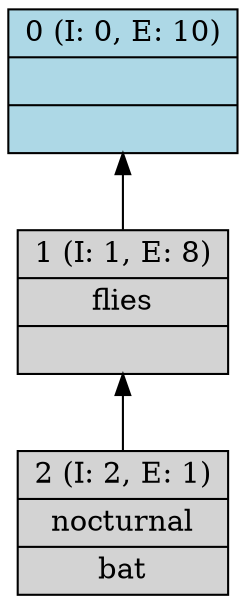

Tu es un expert en **Analyse Formelle de Concepts (FCA)**, en **Python**, en **Graphviz DOT** et en **algorithmes sur DAG**.

Je veux que tu conçoives un **algorithme Python générique, robuste et déterministe** qui transforme un fichier `.dot` de treillis **étiqueté par induction / étiquetage réduit** en un fichier `.dot` **complètement reconstruit, sans induction**, tout en représentant **exactement le même treillis**.

Le cas d'usage typique est le suivant :

- entrée : un fichier du type `FCA4J/Animals11/Lattice/Animals11.dot`
- sortie : un fichier du type `FCA4J/Animals11/Lattice/full/Animals11.dot`

L'algorithme ne doit **jamais être codé pour un exemple particulier**. Il doit fonctionner pour **tout fichier DOT de même famille**.

---

# OBJECTIF EXACT

Écrire un script Python qui :

1. lit un fichier DOT représentant un treillis FCA,
2. parse les nœuds, leurs labels et les arêtes,
3. reconnaît que le DOT d'entrée utilise un **étiquetage réduit** :
	- la partie `intent` d'un nœud contient seulement les attributs **introduits** à ce nœud,
	- la partie `extent` d'un nœud contient seulement les objets **introduits** à ce nœud,
4. reconstruit pour chaque concept :
	- son **intent complet**,
	- son **extent complet**,
5. réécrit un nouveau fichier DOT avec les **mêmes nœuds** et les **mêmes arêtes de couverture**, mais avec des labels **non induits**, donc complets,
6. préserve autant que possible le style du fichier source :
	- `digraph G { ... }`
	- `rankdir=BT;`
	- `shape=record`
	- `style=filled`
	- `fillcolor=...` si présent
	- ordre des nœuds et des arêtes si possible.

---

# SENS MATHÉMATIQUE ATTENDU

Dans ce type de DOT FCA :

- chaque nœud représente un concept formel,
- les arêtes représentent la **relation de couverture** du treillis,
- l'orientation observée est celle des exemples FCA4J :
  **concept plus spécifique -> concept plus général**.

Autrement dit, si `u -> v`, alors en général :

- `intent(v) ⊂ intent(u)`
- `extent(u) ⊂ extent(v)`

Le fichier d'entrée est **réduit** :

- les attributs affichés sur un nœud sont seulement ceux introduits à ce nœud,
- les objets affichés sur un nœud sont seulement ceux introduits à ce nœud.

Le fichier de sortie doit être **complet** :

- `intent_complet(n)` = union des attributs réduits de `n` et de tous les nœuds atteignables **en dessous** de `n`,
- `extent_complet(n)` = union des objets réduits de `n` et de tous les nœuds atteignables **au-dessus** de `n`.

Tu dois expliquer pourquoi cette reconstruction est correcte pour un treillis FCA réduit.

---

# FORMAT DU DOT D'ENTRÉE

Le fichier suit ce schéma général :



Le label d'un nœud est un record à 3 champs :

```text
{HEADER|INTENT_PART|EXTENT_PART}
```

où :

- `HEADER` ressemble à : `12 (I: 2, E: 6)`
- `INTENT_PART` est une liste d'attributs séparés par `\n`
- `EXTENT_PART` est une liste d'objets séparés par `\n`

Les champs `INTENT_PART` ou `EXTENT_PART` peuvent être vides.

Le script doit être robuste face à :

- espaces optionnels,
- présence ou absence de `fillcolor`,
- ordre variable des attributs DOT dans un nœud,
- lignes vides,
- labels avec ou sans contenu dans intent/extent,
- nœuds définis avant ou après certaines arêtes.

---

# CONTRAINTES FORTES

Le code doit :

1. être en **Python standard**,
2. éviter les dépendances externes inutiles,
3. fonctionner pour tout treillis DOT de cette famille,
4. ne faire **aucun hard-code** sur `Animals11`, `eg9_9`, ou un identifiant de nœud particulier,
5. ne pas supposer que les identifiants de nœuds sont contigus,
6. ne pas supposer qu'un nœud sans label réduit a intent ou extent vide dans le résultat,
7. reconstruire les ensembles par la structure du graphe,
8. recalculer `I` et `E` dans le label final à partir des ensembles complets reconstruits,
9. préserver les arêtes du treillis inchangées,
10. produire une sortie déterministe.

---

# MÉTHODE ALGORITHMIQUE ATTENDUE

Tu dois concevoir une solution claire en plusieurs étapes.

## Étape 1 — Parsing du DOT

Explique comment parser :

- les définitions de nœuds,
- les attributs DOT du nœud,
- le champ `label`,
- les arêtes `u -> v`.

Le parseur doit extraire pour chaque nœud :

- `node_id`
- attributs DOT bruts utiles à la réécriture (`shape`, `style`, `fillcolor`, etc.)
- `header` initial si utile
- `reduced_intent_labels`
- `reduced_extent_labels`

Propose une structure de données adaptée, par exemple une `dataclass` `Node`.

## Étape 2 — Construction du DAG

Explique comment construire :

- les successeurs,
- les prédécesseurs,
- un ordre topologique.

Vérifie que le graphe est acyclique. Si un cycle est détecté, lève une erreur explicite.

## Étape 3 — Reconstruction de l'intent complet

Explique pourquoi, avec cette orientation des arêtes, on peut calculer :

`full_intent[n] = reduced_intent[n] ∪ ⋃ full_intent[s]` pour tous les successeurs `s` de `n`.

Impose une implémentation efficace par programmation dynamique sur ordre topologique inversé.

## Étape 4 — Reconstruction de l'extent complet

Explique pourquoi on peut calculer :

`full_extent[n] = reduced_extent[n] ∪ ⋃ full_extent[p]` pour tous les prédécesseurs `p` de `n`.

Impose une implémentation efficace sur ordre topologique direct.

## Étape 5 — Validation structurelle

Ajoute des contrôles de cohérence :

- pour chaque arête `u -> v`, vérifier que `full_intent[v] ⊆ full_intent[u]`,
- pour chaque arête `u -> v`, vérifier que `full_extent[u] ⊆ full_extent[v]`,
- signaler toute anomalie de reconstruction.

## Étape 6 — Réécriture du label DOT

Le nouveau label doit avoir exactement la forme :

```text
{ID (I: X, E: Y)|intent1\nintent2\n...\n|extent1\nextent2\n...\n}
```

avec :

- `X = len(full_intent)`
- `Y = len(full_extent)`

Respecte le cas vide :

- intent vide -> champ vide entre deux `|`
- extent vide -> champ vide final

Préserve l'ordre de présentation des labels de manière déterministe. Si le DOT d'entrée n'impose pas un ordre global fiable, utilise un ordre stable explicite, documenté dans la solution.

## Étape 7 — Écriture du fichier de sortie

Le script doit :

- conserver l'en-tête `digraph G {` et `rankdir=BT;`
- réécrire tous les nœuds avec leurs styles initiaux,
- réécrire toutes les arêtes d'origine,
- sauvegarder le résultat dans un chemin cible donné.

---

# EXIGENCES DE ROBUSTESSE

Le code doit gérer correctement :

- un intent réduit vide,
- un extent réduit vide,
- le concept sommet et le concept bas,
- des labels introduits répartis sur plusieurs niveaux,
- des treillis plus gros que l'exemple `Animals11`,
- des noms d'objets ou d'attributs contenant des tirets,
- l'échappement minimal nécessaire pour Graphviz.

Explique aussi comment éviter les doublons si, par anomalie, un label apparaissait plusieurs fois lors de l'agrégation.

---

# SORTIE ATTENDUE DE TA RÉPONSE

Je veux une réponse structurée en 4 parties :

## 1. Compréhension du problème

Résume précisément la différence entre :

- DOT induit / réduit
- DOT complet / non induit

## 2. Méthode algorithmique

Explique clairement l'algorithme, ses invariants et sa complexité temporelle/spatiale.

## 3. Code Python complet

Fournis un script **exécutable** avec au minimum les fonctions suivantes :

- `parse_dot_file()`
- `parse_record_label()`
- `topological_sort()`
- `reconstruct_full_intents()`
- `reconstruct_full_extents()`
- `build_full_label()`
- `write_full_dot()`
- `convert_induced_dot_to_full_dot()`
- `main()`

## 4. Exemple d'utilisation

Montre l'appel CLI suivant :

```bash
python induced_to_full_dot.py input.dot output.dot
```

et explique ce que le script produit.

---

# EXIGENCES DE QUALITÉ DU CODE

Le code doit être :

- lisible,
- modulaire,
- commenté avec parcimonie mais utilement,
- testé sur les cas limites évidents,
- sans dépendance externe,
- compatible Python 3.10+.

Ajoute si utile une petite fonction de test ou de validation interne.

---

# POINT IMPORTANT À NE PAS OUBLIER

Le but n'est **pas** de recalculer le treillis à partir d'un CSV.

Le but est de **reconstruire les intents/extents complets uniquement à partir du fichier DOT réduit et de sa structure de graphe**.

Le treillis représenté en sortie doit être **strictement le même treillis** que celui de l'entrée, seuls les labels changent d'une représentation réduite vers une représentation complète.

Maintenant, produis :

1. une explication rigoureuse,
2. puis le code Python complet.
