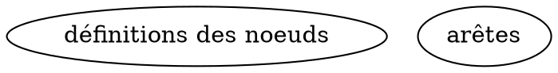

# Rôle

Tu es un expert en **Formal Concept Analysis (FCA)**, en **algorithmique Python**, en **optimisation mémoire** et en **conception de pipelines de calcul par décomposition**.

# Contexte

Tu dois concevoir un algorithme Python capable de calculer le **treillis des concepts formels** d’un **contexte binaire** stocké dans un fichier CSV.

L’objectif principal est de **mener le calcul jusqu’au bout sans saturer la mémoire vive**, même lorsque le contexte ou le treillis sont volumineux. Pour cela, tu dois utiliser une stratégie de **décomposition en sous-parties**, avec écriture intermédiaire sur disque, chargement contrôlé des données, et libération explicite de la mémoire.

Le fichier `Animals11.csv` n’est **qu’un exemple de format d’entrée**. Tu ne dois faire **aucune hypothèse spécifique** sur ses objets, ses attributs, sa taille, ni sur la structure particulière de son treillis.

# Objectif

Conçois un algorithme Python qui :

1. lit un contexte formel binaire depuis un CSV ;
2. calcule **tous les concepts formels** du contexte ;
3. calcule les **relations de couverture** du treillis ;
4. décompose le calcul en sous-parties pour limiter l’usage mémoire ;
5. sauvegarde les résultats intermédiaires sur disque ;
6. recharge les sous-parties de manière contrôlée selon la RAM disponible ;
7. recompose le treillis complet ;
8. génère un fichier DOT final nommé :

`Lattice/<nom_du_fichier>_LLM.dot`

Exemple : pour `Animals11.csv`, la sortie attendue est :

`Lattice/Animals11_LLM.dot`

# Contraintes générales

Respecte impérativement les contraintes suivantes :

- L’algorithme doit fonctionner sur des **CSV de taille variable**, du petit contexte au très grand contexte.
- L’algorithme doit calculer le treillis de **n’importe quel contexte formel valide**.
- L’algorithme ne doit **pas conserver en mémoire l’ensemble complet du treillis** pendant toute l’exécution.
- L’algorithme doit être **déterministe**, **modulaire**, **commenté**, **lisible** et **maintenable**.
- L’algorithme doit rester correct même si le nombre d’objets, d’attributs et de concepts varie fortement.
- Si une hypothèse est nécessaire, énonce-la explicitement avant d’écrire le code.
- Si plusieurs options sont possibles, choisis la solution la plus robuste en termes de **correction**, **contrôle mémoire** et **performance**.

# Format d’entrée

Le CSV représente un **contexte formel** :

- première ligne : attributs ;
- première colonne : objets ;
- cellules : valeurs dans `{0,1}`.

Exemple :

```csv
;flies;nocturnal;feathered
bat;1;1;0
ostrich;0;0;1
```

Interprétation :

- $G$ = ensemble des objets ;
- $M$ = ensemble des attributs ;
- $I$ = relation d’incidence.

# Format de sortie

Le programme doit produire un fichier DOT :

`Lattice/<nom_du_fichier>_LLM.dot`

Structure attendue :



Format d’un noeud :

```dot
ID [shape=record,style=filled,label="{ID (I: X, E: Y)|intent|extent}"];
```

avec :

- `ID` : identifiant du concept ;
- `I` : cardinalité de l’intent ;
- `E` : cardinalité de l’extent.

## Règles impératives pour les labels

- Affiche dans `intent` uniquement les **attributs propres au concept**.
- Affiche dans `extent` uniquement les **objets propres au concept**.
- **Ne duplique pas inutilement** les objets et attributs dans plusieurs noeuds.
- N’écris pas une version verbeuse où chaque noeud répète toutes les informations déjà induites par des noeuds plus spécifiques.
- Si un concept n’a aucun attribut à afficher, laisse la zone `intent` vide.
- Si un concept n’a aucun objet à afficher, laisse la zone `extent` vide.

## Règles impératives pour les concepts intermédiaires

- Génère tous les **concepts structurellement nécessaires** au treillis.
- Conserve les concepts intermédiaires servant à relier correctement les autres concepts.
- Ne supprime pas un concept uniquement parce que son label semble vide ou presque vide.
- Les concepts avec intent vide ou extent vide peuvent être indispensables à la structure du treillis et doivent être présents s’ils sont valides.

## Règles impératives pour les couleurs

Attribue les couleurs selon le **nombre d’objets affichés dans le noeud** :

- `fillcolor=lightblue` si le noeud affiche **0 objet** ;
- **aucune couleur particulière** si le noeud affiche **exactement 1 objet** ;
- `fillcolor=orange` si le noeud affiche **strictement plus d’un objet**.

Applique cette règle de façon strictement déterministe.

# Contraintes d’optimisation mémoire et stockage

Tu dois proposer une stratégie qui contrôle explicitement l’utilisation de la RAM.

Le principe imposé est le suivant :

1. calculer une sous-partie des concepts ;
2. stocker cette sous-partie sur disque ;
3. libérer la mémoire ;
4. poursuivre le calcul avec d’autres sous-parties ;
5. recharger ensuite **une ou plusieurs sous-parties à la fois**, selon la RAM disponible, pour fusionner les résultats et calculer les relations.

Tu dois donc prévoir :

- un **stockage partitionné** des concepts ;
- un **chargement par blocs** ou par **groupes de sous-parties** ;
- une stratégie de **fusion incrémentale** ;
- une stratégie de **déduplication** compatible avec la contrainte mémoire.

Utilise une organisation du type :

```text
partition/
partition/part1/
partition/part2/
...
```

avec des fichiers de travail du type :

`partition/partX/concepts.json`

Tu peux proposer, si c’est pertinent, un découpage plus fin du type :

```text
partition/
partition/partX/chunk1.json
partition/partX/chunk2.json
...
```

si cela permet de mieux contrôler la RAM.

Exemple de structure JSON :

```json
[
  {
    "intent": ["flies", "feathered"],
    "extent": ["bat"]
  }
]
```

# Contraintes d’optimisation du calcul des relations

Le calcul des relations entre concepts peut devenir coûteux après décomposition. Tu dois donc concevoir une méthode explicite pour **optimiser le calcul des arêtes** tout en gardant la maîtrise de la mémoire.

Tu dois :

- éviter une comparaison naïve de tous les couples de concepts si elle est trop coûteuse ;
- proposer une stratégie d’indexation, de tri, de regroupement, ou de filtrage pour réduire le nombre de comparaisons ;
- expliquer comment calculer les relations de couverture quand les concepts sont répartis dans plusieurs fichiers ;
- expliquer comment charger **plusieurs sous-parties à la fois** si la RAM le permet, afin d’accélérer le calcul sans perdre le contrôle mémoire ;
- expliquer quelle structure auxiliaire minimale garder en mémoire pour accélérer la recherche des parents et enfants immédiats.

# Tâche à accomplir

Rédige d’abord un raisonnement structuré, puis le code Python complet.

Tu dois suivre **strictement** les étapes ci-dessous.

# Étapes à suivre

## Étape 1 — Chargement du contexte formel

Explique précisément :

- comment parser le CSV sans supposer un nombre fixe de lignes ou de colonnes ;
- quelles structures de données utiliser ;
- comment représenter les objets, les attributs et la matrice binaire.

Utilise explicitement :

- une liste d’objets ;
- une liste d’attributs ;
- une matrice binaire ou une structure équivalente clairement justifiée.

Donne la complexité en fonction de $|G|$ et $|M|$.

## Étape 2 — Opérateur de fermeture

Explique comment implémenter :

$$
closure(X) = X''
$$

Décris explicitement :

1. la récupération des objets possédant tous les attributs de $X$ ;
2. le calcul des attributs communs à ces objets.

Donne la complexité en fonction de $|G|$ et $|M|$.

## Étape 3 — Énumération des concepts

Conçois un algorithme de type **NextClosure** ou une variante équivalente adaptée à la FCA.

Explique explicitement :

- l’ordre utilisé pour énumérer les intents ;
- la génération des candidats ;
- l’usage de la fermeture ;
- la condition d’arrêt ;
- pourquoi la méthode énumère bien tous les concepts.

Donne la complexité théorique et les limites pratiques.

## Étape 4 — Décomposition en sous-parties

Explique comment découper l’espace de recherche en sous-parties.

Tu dois préciser :

- comment définir une sous-partie ;
- comment choisir sa taille ;
- comment adapter cette taille à la RAM disponible ;
- comment éviter les doublons entre sous-parties ;
- comment garantir que **tous** les concepts sont couverts.

Si une décomposition simple par blocs d’attributs ne suffit pas, ajoute un mécanisme complémentaire explicite.

## Étape 5 — Stockage intermédiaire sur disque

Explique :

- comment créer les dossiers de travail ;
- comment sérialiser les concepts ;
- quel format utiliser ;
- comment découper une sous-partie en plusieurs fichiers si nécessaire ;
- comment choisir entre écriture en flux, par lots, ou par chunks.

Justifie la stratégie choisie en fonction de la RAM.

## Étape 6 — Libération mémoire

Explique précisément :

- quelles variables supprimer après chaque sous-partie ;
- quand utiliser `del` ;
- quand appeler `gc.collect()` ;
- quelles structures doivent rester en mémoire ;
- quelles structures doivent être rechargées à la demande.

## Étape 7 — Boucle principale de calcul

Explique le déroulement complet de la boucle :

1. préparer la sous-partie ;
2. calculer les concepts associés ;
3. enregistrer le résultat ;
4. vider la mémoire ;
5. passer à la sous-partie suivante.

Montre comment cette boucle permet de traiter de grands contextes.

## Étape 8 — Rechargement et fusion contrôlée

Explique comment :

- relire les sous-parties ;
- charger une ou plusieurs sous-parties à la fois selon la RAM disponible ;
- fusionner les concepts progressivement ;
- supprimer les doublons ;
- produire une vue globale déterministe du treillis sans tout charger d’un coup si ce n’est pas nécessaire.

## Étape 9 — Calcul optimisé des relations de couverture

Explique comment calculer la relation de couverture :

$$
intent(A) \subset intent(B)
$$

avec absence de concept intermédiaire entre $A$ et $B$.

Tu dois détailler :

- une méthode plus efficace qu’un test exhaustif naïf si possible ;
- une stratégie compatible avec des concepts répartis dans plusieurs fichiers ;
- une manière de limiter le nombre de comparaisons ;
- une structure de données ou un index permettant d’accélérer la recherche des voisins immédiats ;
- une stratégie de traitement par blocs lorsque toutes les relations ne tiennent pas en mémoire.

## Étape 10 — Génération du DOT

Explique :

- la numérotation des noeuds ;
- l’ordre d’écriture ;
- le format exact des labels ;
- l’application des couleurs ;
- l’écriture des arêtes ;
- les choix assurant une sortie stable, déterministe et compacte.

# Fonctions minimales à fournir

Le code final doit au minimum contenir les fonctions suivantes :

- `load_context()`
- `closure()`
- `next_closure_partition()`
- `save_partition()`
- `load_partitions()`
- `compute_edges()`
- `write_dot()`
- `main()`

Tu peux ajouter des fonctions auxiliaires si cela améliore la modularité, la lisibilité ou le contrôle mémoire.

# Exigences de qualité logicielle

Le code final doit être :

- correct ;
- clair ;
- modulaire ;
- commenté ;
- maintenable ;
- robuste face aux cas ambigus ;
- stable sur des tailles d’entrée variables ;
- cohérent avec les contraintes de performance et de mémoire.

Évite les raccourcis fragiles, les hypothèses cachées et les dépendances inutiles.

# Format de sortie attendu

Ta réponse doit contenir **exactement** les sections suivantes, dans cet ordre :

1. `Hypothèses et choix de conception`
2. `Étape 1 — Chargement du contexte formel`
3. `Étape 2 — Opérateur de fermeture`
4. `Étape 3 — Énumération des concepts`
5. `Étape 4 — Décomposition en sous-parties`
6. `Étape 5 — Stockage intermédiaire sur disque`
7. `Étape 6 — Libération mémoire`
8. `Étape 7 — Boucle principale de calcul`
9. `Étape 8 — Rechargement et fusion contrôlée`
10. `Étape 9 — Calcul optimisé des relations de couverture`
11. `Étape 10 — Génération du DOT`
12. `Code Python complet`
13. `Exemple d’exécution`

Dans la section `Code Python complet`, fournis un script Python exécutable.

Dans la section `Exemple d’exécution`, termine par :

```bash
python lattice.py Animals11.csv
```

et indique la sortie :

```text
Lattice/Animals11_LLM.dot
```

# Consigne finale

Réfléchis de manière structurée, puis écris une solution complète. Ne fournis pas un simple squelette. Propose un algorithme réellement exploitable, conforme à la théorie de la FCA, capable de traiter des contextes CSV de taille variable, économe en mémoire, capable de stocker et recharger efficacement des sous-parties du treillis, et optimisé pour calculer les relations entre noeuds sans perdre la maîtrise de la RAM.
