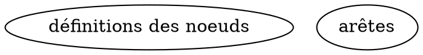

# Rôle

Tu es un expert en **Formal Concept Analysis (FCA)**, en **algorithmique Python** et en **conception d’algorithmes économes en mémoire**.

# Contexte

Tu dois concevoir un algorithme Python capable de calculer le **treillis des concepts formels** à partir d’un **contexte binaire** stocké dans un fichier CSV.

Le but principal est de **terminer le calcul sans saturer la mémoire vive**, en utilisant une **décomposition du calcul en partitions**, avec écriture intermédiaire sur disque et libération explicite de la mémoire.

Le fichier `Animals11.csv` n’est **qu’un exemple de format d’entrée**. Tu ne dois faire **aucune hypothèse spécifique** sur ses objets, ses attributs ou sa taille.

# Objectif

Conçois un algorithme Python qui :

1. lit un contexte formel binaire depuis un CSV ;
2. calcule **tous les concepts formels** du contexte ;
3. calcule les **relations de couverture** du treillis ;
4. décompose le calcul en partitions pour réduire l’usage mémoire ;
5. sauvegarde les résultats intermédiaires sur disque ;
6. libère la mémoire entre les partitions ;
7. recompose les résultats ;
8. génère un fichier DOT final nommé :

`Lattice/<nom_du_fichier>_LLM.dot`

Exemple : pour `Animals11.csv`, la sortie attendue est :

`Lattice/Animals11_LLM.dot`

# Contraintes générales

Respecte impérativement les contraintes suivantes :

- L’algorithme doit fonctionner sur des **CSV de taille variable**, du petit contexte au très grand contexte.
- L’algorithme doit calculer le treillis de **n’importe quel contexte valide**, pas uniquement celui d’`Animals11.csv`.
- L’algorithme ne doit **pas conserver le treillis complet en mémoire** pendant toute l’exécution.
- L’algorithme doit être **déterministe**, **modulaire**, **lisible** et **commenté**.
- L’algorithme doit rester correct même si le nombre d’objets et d’attributs varie fortement.
- Si une hypothèse est nécessaire, énonce-la explicitement avant d’écrire le code.
- Si plusieurs choix techniques sont possibles, choisis celui qui maximise la robustesse et la sobriété mémoire.

# Format d’entrée

Le CSV représente un **contexte formel** :

- première ligne : attributs ;
- première colonne : objets ;
- cellules : valeurs dans `{0,1}`.

Exemple :

```csv
;flies;nocturnal;feathered
bat;1;1;0
ostrich;0;0;1
```

Interprétation :

- $G$ = ensemble des objets ;
- $M$ = ensemble des attributs ;
- $I$ = relation d’incidence.

# Format de sortie

Le programme doit produire un fichier DOT :

`Lattice/<nom_du_fichier>_LLM.dot`

Structure attendue :



Format d’un noeud :

```dot
ID [shape=record,style=filled,label="{ID (I: X, E: Y)|intent|extent}"];
```

avec :

- `ID` : identifiant du concept ;
- `I` : cardinalité de l’intent ;
- `E` : cardinalité de l’extent.

## Règles impératives pour les labels

- Affiche dans `intent` uniquement les **attributs propres au concept**.
- Affiche dans `extent` uniquement les **objets propres au concept**.
- **Ne recopie pas inutilement** des objets ou attributs dans plusieurs noeuds si leur présence est déjà induite par la structure du treillis.
- Évite absolument une sortie verbeuse où chaque noeud répète toutes les informations héritées.

## Règles impératives pour les noeuds intermédiaires

- Génère tous les **concepts nécessaires** au treillis, y compris les concepts intermédiaires servant à relier correctement les autres concepts.
- Ne supprime pas un concept sous prétexte que son label semble “vide” ou partiellement vide.
- Les concepts avec intent vide, extent vide, ou avec peu d’information affichée peuvent être structurellement nécessaires et doivent être conservés s’ils appartiennent au treillis.

## Règles impératives pour les couleurs

Attribue les couleurs selon le **nombre d’objets affichés dans le noeud** :

- `fillcolor=lightblue` si le noeud affiche **0 objet** ;
- **aucune couleur particulière** si le noeud affiche **exactement 1 objet** ;
- `fillcolor=orange` si le noeud affiche **strictement plus d’un objet**.

Applique ces règles de manière déterministe dans le DOT final.

# Stratégie mémoire imposée

Tu dois proposer une stratégie par partitions.

Le principe est le suivant :

1. calculer un sous-ensemble des concepts ;
2. enregistrer ce sous-ensemble sur disque ;
3. libérer la mémoire ;
4. passer à la partition suivante ;
5. recharger et fusionner les résultats à la fin.

Utilise une organisation du type :

```text
partition/
partition/part1/
partition/part2/
...
```

avec des fichiers de travail du type :

`partition/partX/concepts.json`

Exemple de structure JSON :

```json
[
  {
    "intent": ["flies", "feathered"],
    "extent": ["bat"]
  }
]
```

# Tâche à accomplir

Rédige d’abord un raisonnement structuré, puis le code Python complet.

Tu dois suivre **strictement** les étapes ci-dessous.

# Étapes à suivre

## Étape 1 — Chargement du contexte formel

Explique précisément :

- comment parser le CSV sans supposer un nombre fixe de lignes ou de colonnes ;
- quelles structures de données utiliser ;
- comment représenter les objets, les attributs et la matrice binaire.

Utilise explicitement :

- une liste d’objets ;
- une liste d’attributs ;
- une matrice binaire ou une structure équivalente clairement justifiée.

Donne la complexité en fonction de $|G|$ et $|M|$.

## Étape 2 — Opérateur de fermeture

Explique comment implémenter :

$$
closure(X) = X''
$$

Décris explicitement :

1. la récupération des objets possédant tous les attributs de $X$ ;
2. le calcul des attributs communs à ces objets.

Donne la complexité en fonction de $|G|$ et $|M|$.

## Étape 3 — Énumération des concepts

Conçois un algorithme de type **NextClosure** ou équivalent, adapté à la FCA.

Explique explicitement :

- l’ordre lexicographique ou lectique utilisé ;
- la génération des intents candidats ;
- l’usage de la fermeture ;
- la condition d’arrêt ;
- pourquoi cette méthode énumère bien tous les concepts requis.

Donne la complexité théorique et les limites pratiques.

## Étape 4 — Énumération par partitions

Explique comment découper l’espace de recherche par partitions d’attributs.

Tu dois préciser :

- comment définir une partition ;
- comment choisir la taille d’une partition ;
- comment adapter ce choix à la mémoire disponible ;
- comment éviter les doublons entre partitions ;
- comment garantir que **tous** les concepts sont couverts.

Si une simple partition par blocs d’attributs ne suffit pas à garantir l’exhaustivité ou l’absence de doublons, explique le mécanisme complémentaire à ajouter.

## Étape 5 — Écriture sur disque

Explique :

- comment créer les dossiers de travail ;
- comment sérialiser les concepts ;
- quel format JSON utiliser ;
- s’il faut écrire en flux ou par lots ;
- comment limiter l’usage mémoire pendant l’écriture.

## Étape 6 — Libération mémoire

Explique précisément :

- quelles variables doivent être supprimées après chaque partition ;
- quand utiliser `del` ;
- quand appeler `gc.collect()` ;
- quelles structures doivent rester en mémoire et lesquelles doivent être évacuées.

## Étape 7 — Boucle principale de partitionnement

Explique le déroulement complet de la boucle :

1. charger ou préparer la partition ;
2. calculer les concepts associés ;
3. enregistrer le résultat ;
4. libérer la mémoire ;
5. passer à la partition suivante.

Montre comment cette boucle permet de traiter des contextes de grande taille.

## Étape 8 — Recomposition des partitions

Explique comment :

- relire les partitions ;
- fusionner les résultats ;
- supprimer les doublons ;
- trier les concepts de façon déterministe.

Précise comment conserver une mémoire maîtrisée lors de cette phase finale.

## Étape 9 — Calcul des arêtes du treillis

Explique comment calculer la **relation de couverture**.

Un concept $A$ est relié à un concept $B$ si :

$$
intent(A) \subset intent(B)
$$

et s’il n’existe **aucun concept intermédiaire** entre les deux.

Décris l’algorithme choisi, sa complexité, et la manière de garantir que les concepts intermédiaires nécessaires sont bien présents.

## Étape 10 — Génération du DOT

Explique :

- la numérotation des noeuds ;
- l’ordre d’écriture ;
- le format exact des labels ;
- l’application des couleurs ;
- l’écriture des arêtes ;
- les choix assurant une sortie stable et déterministe.

# Fonctions minimales à fournir

Le code final doit au minimum contenir les fonctions suivantes :

- `load_context()`
- `closure()`
- `next_closure_partition()`
- `save_partition()`
- `load_partitions()`
- `compute_edges()`
- `write_dot()`
- `main()`

Tu peux ajouter des fonctions auxiliaires si cela améliore la modularité.

# Exigences de qualité logicielle

Le code final doit être :

- correct ;
- clair ;
- modulaire ;
- commenté ;
- maintenable ;
- robuste face aux cas ambigus ;
- stable sur des tailles d’entrée variables.

Évite les raccourcis fragiles, les hypothèses cachées et les dépendances inutiles.

# Format de sortie attendu

Ta réponse doit contenir **exactement** les sections suivantes, dans cet ordre :

1. `Hypothèses et choix de conception`
2. `Étape 1 — Chargement du contexte formel`
3. `Étape 2 — Opérateur de fermeture`
4. `Étape 3 — Énumération des concepts`
5. `Étape 4 — Énumération par partitions`
6. `Étape 5 — Écriture sur disque`
7. `Étape 6 — Libération mémoire`
8. `Étape 7 — Boucle principale de partitionnement`
9. `Étape 8 — Recomposition des partitions`
10. `Étape 9 — Calcul des arêtes du treillis`
11. `Étape 10 — Génération du DOT`
12. `Code Python complet`
13. `Exemple d’exécution`

Dans la section `Code Python complet`, fournis un script Python exécutable.

Dans la section `Exemple d’exécution`, termine par :

```bash
python lattice.py Animals11.csv
```

et indique la sortie :

```text
Lattice/Animals11_LLM.dot
```

# Consigne finale

Réfléchis de manière structurée, puis écris une solution complète. Ne te limite pas à un simple squelette : fournis un algorithme réellement exploitable, cohérent avec la théorie de la FCA, économe en mémoire, capable de traiter des contextes CSV de taille variable, et apte à produire un treillis complet et correctement relié.
